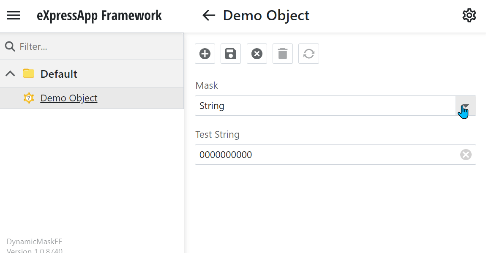

<!-- default badges list -->

<!-- default badges end -->

# XAF - How to dynamically change mask settings based on the current object

This example demonstrates how to change mask settings of a certain editor dynamically, e.g. based on properties of the current object.
  
<kbd></kbd>
## Implementation Details

There are two ways to implement this functionality:

1. Implement a `ViewController` that handles events of the current view and changes settings of required editors, as shown in the following topic: [Access the Settings of a Property Editor in a Detail View](https://docs.devexpress.com/eXpressAppFramework/402153/getting-started/in-depth-tutorial-blazor/customize-data-display-and-view-layout/access-editor-settings).
2. Implement a custom Property Editor (e.g. a descendant of the corresponding built-in property editor) and change settings of its control. For more information, refer to the following help section: [Property Editors](https://docs.devexpress.com/eXpressAppFramework/113097/ui-construction/view-items-and-property-editors/property-editors?p=netframework).

This example demonstrates the first approach. To implement it, the following classes are added:

* `DemoObject` - a persistent class with `TestString` and `Mask` properties. Mask settings of the `TestString` property are changed based on the value of the `Mask` property.
* `ChangeMaskControllerBase` - a platform-independent controller that handles events required to update the mask settings at the appropriate time.
* `WinChangeMaskController` - a WinForms-specific controller that customizes settings of a WinForms control.
* `BlazorChangeMaskController` - an Blazor-specific controller that customizes settings of a Blazor control.

Note that these approaches can be used only for detail views. To implement the same functionality in a ListView, create a ViewController for it and customize its List Editor according to specifics of the List Editor's control (see [How to: Access the Grid Component in a List View](https://docs.devexpress.com/eXpressAppFramework/402154/ui-construction/list-editors/how-to-access-list-editor-control)). For example, in WinForms you can use the `GridView.CustomColumnDisplayText` event to pass the required text directly to a grid cell. You can also use the `GridView.CustomRowCellEdit` event to supply editors with different settings for different rows. 

## Files to Review

* [BlazorChangeMaskController.cs](./CS/EFCore/DynamicMaskEF/DynamicMaskEF.Blazor.Server/Controllers/BlazorChangeMaskController.cs)
* [WinChangeMaskController.cs](./CS/EFCore/DynamicMaskEF/DynamicMaskEF.Win/Controllers/WinChangeMaskController.cs)
* [DemoObject.cs](./CS/EFCore/DynamicMaskEF/DynamicMaskEF.Module/BusinessObjects/DemoObject.cs )
* [ChangeMaskControllerBase.cs](./CS/EFCore/DynamicMaskEF/DynamicMaskEF.Module/Controllers/ChangeMaskControllerBase.cs)

## Documentation

* [Input Mask (WinForms)](https://docs.devexpress.com/WindowsForms/583/controls-and-libraries/editors-and-simple-controls/common-editor-features-and-concepts/input-mask)
* [Mask (ASP.NET Web Forms)](https://docs.devexpress.com/AspNet/8171/components/data-editors/common-concepts/mask-editing)

## More Examples

* [Multi-currency DisplayFormats in a ListView](https://supportcenter.devexpress.com/ticket/details/q310943/multi-currency-displayformats-in-a-listview)
* [Formatting depending on another field value](https://supportcenter.devexpress.com/ticket/details/q500155/formatting-depending-on-another-field-value)
* [How to apply a (DisplayFormat) Mask to a value shown in a ListView?](https://supportcenter.devexpress.com/ticket/details/t297444/how-to-apply-a-displayformat-mask-to-a-value-shown-in-a-listview)
